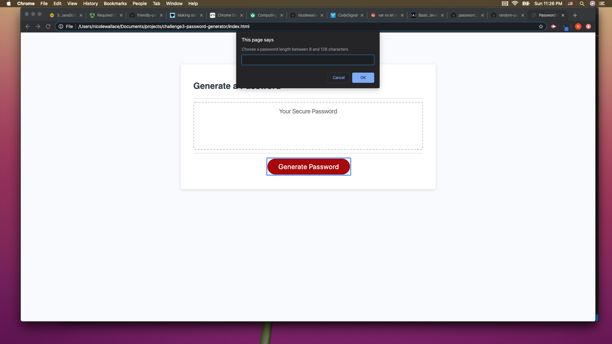

# Randomize Password Generator 

## Description 
This project uses JavaScript to generate a random password. Criteria: Password length must be between 8 to 128 characters. User can choose lowercase, uppercase, numeric, and/or special characters.

## Table of Contents
* [Installation](#installation)
* [Usage](#usage)
* [License](#license)
* [Contributing](#contributing)
* [Tests](#tests)
* [Questions](#questions)

## Installation 
No installation required.

## Usage 
This application will allow users generate a random password based on the criteria they select. 
Please view live deployed Git Hub [URL](https://nicolewallace09.github.io/challenge3-password-generator/)

## License 
This project is license under MIT

## Contributing 
Contributors should read the installation section. 

## Tests
There are no tests for this application. 

## Questions
If you have any questions about this projects, please contact me directly at nicole.elisaw@gmail.com. You can view more of my projects at https://github.com/nicolewallace09.